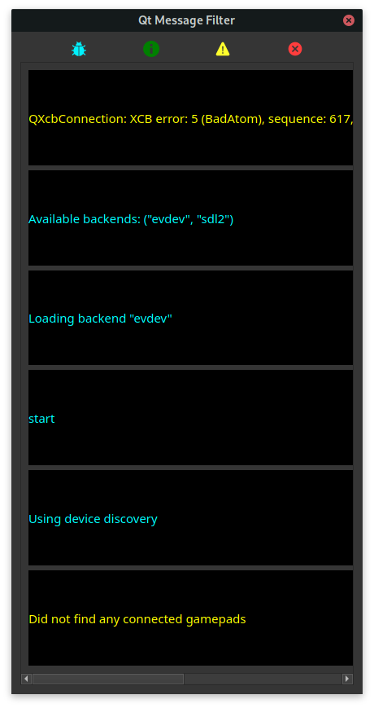

# [QtMessageFilter](https://github.com/Bollos00/QtMessageFilter)

This repository implements a [Message Handler for Qt Applications](https://doc.qt.io/qt-5/qtglobal.html#QtMessageHandler-typedef). It can be useful if the your aim is to debug code on your Qt Application or generate a log file with all messages registred at the end of the execution of each session. The QtMessageFilter class, that way, contains two features, first it allows you to debug your code with a simple GUI that shows all messages generated with its contexts, secondly it register all those messages on a log file.




If you are using QMake and want to include this feature on your project, just get the content of `./QtMessageFilter` and include the `QtMessageFilter.pri` file on your project, something like:
```qmake
include(QtMessageFilter/QtMessageFilter.pri)
```

It can receive messages coming from multiple threads and can be initialized with `QtMessageFilter::resetInstance()`, calling this will install the message handler and make all messages to be treated on the `QtMessageFilter` class. Even tho it is expected to use it during all run time, you can reinstall the default message handler calling `QtMessageFilter::releaseInstance()`, this will also delete the instance of the class. You can omit and show the QtMessageFilter GUI calling `QtMessageFilter::hideDialog()` and `QtMessageFilter::showDialog()`. I have ~~lazily~~ documented the behaviour of this class with a little more details [here](https://github.com/Bollos00/QtMessageFilter/blob/master/QtMessageFilter/src/QtMessageFilter/qtmessagefilter.h).

You may also want to see a silly implementation of on the `tests` directory, the example shows a simple gui that create messages of the four different types each 0,5 seconds. There, it is also possible to hide and show the QtMessageFilter dialog and reinstall the message handler.
